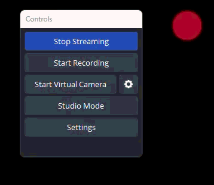

# OBS Live Now Indicator

A Windows desktop application that displays a live indicator on all connected monitors when OBS Studio is streaming.



## Usage

1. Start the application
2. The app will minimize to the system tray
3. Configure OBS WebSocket connection in Settings
4. When you start streaming in OBS, a pulsing icon will appear in the top-right corner of each monitor
5. The icon disappears when streaming stops

## Features

- **OBS WebSocket Integration**: Monitors OBS streaming status in real-time
- **Multi-Monitor Support**: Shows indicators on all connected displays in the top-right corner
- **Customizable Live Icon**: Choose between Star (4-pointed, candle-like pulse), Circle, or Square
- **Secure Password Storage**: OBS WebSocket password encrypted using Windows DPAPI
- **System Tray Integration**: Runs in the background with easy access from system tray
- **Auto-Start**: Optionally run on Windows startup
- **Candle-like Animation**: Smooth pulsing animation resembling a flickering candle

## System Requirements

- Windows 10 or later
- .NET 8 Runtime
- OBS Studio with WebSocket plugin (OBS 28+ has it built-in)

## Installation

1. Build the project or download the release
2. Run `ObsLiveNowIndicator.exe`
3. Configure OBS WebSocket settings via the system tray icon
4. Enable "Run on Windows startup" if desired

## Configuration

Right-click the system tray icon and select "Settings" to configure:

- **OBS WebSocket URL**: Default is `ws://localhost`
- **Port**: Default is `4455` (OBS WebSocket default)
- **Password**: Optional password for OBS WebSocket authentication
- **Icon Type/Size/Opacity**: Choose between Star, Circle, or Square, their sizes and opacity
- **Icon Position**: Choose placement on screen (Top/Bottom × Left/Center/Right)
- **Run on Startup**: Enable/disable auto-start with Windows

## OBS WebSocket Setup

1. In OBS Studio, go to **Tools → WebSocket Server Settings**
2. Enable WebSocket server
3. Note the port number (default: 4455)
4. Set a password if desired
5. Enter these settings in the Live Indicator app

## Building from Source

### Prerequisites
- .NET 8 SDK or later
- Visual Studio 2022 or VS Code (optional)

### Build Instructions

**Using Command Line:**
```bash
# Clone the repository
git clone <repository-url>

# Navigate to the project directory
cd ObsLiveNowIndicator

# Restore packages and build
dotnet build -c Release

# The executable will be in:
# ObsLiveNowIndicator\bin\Release\net8.0-windows\ObsLiveNowIndicator.exe
```

**Using the provided batch file:**
```bash
# Simply run the build script
build.bat
```

**To run in development mode:**
```bash
dotnet run --project ObsLiveNowIndicator
# Or use: run.bat
```

## Creating a Release

1. Update version in `ObsLiveNowIndicator.csproj` and `app.manifest`
2. Commit changes: `git commit -m "Bump version to X.Y.Z"`
3. Create tag: `git tag vX.Y.Z`
4. Push tag: `git push origin vX.Y.Z`
5. GitHub Actions will automatically build and create the release

## Credits

- Uses [obs-websocket-dotnet](https://github.com/BarRaider/obs-websocket-dotnet) for OBS WebSocket communication
- Built with WPF and .NET 10

## Disclaimer

This application was fully created through AI-assisted "vibe coding" using GitHub Copilot. While i have professional experience in .NET, this project served as an excellent candidate for exploring AI-assisted development workflows. The entire codebase, from architecture to implementation, was generated through natural language conversations.